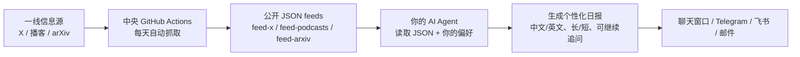

# AI Signal

> 追踪 AI 一线的声音——做事的人、写代码的人、下注的人，不是二手转述。每天自动抓取 AI 播客、推文和论文，让你的 Agent 生成个性化日报。

[](https://github.com/tokenaissance/ai-signal/releases)
[](https://github.com/tokenaissance/ai-signal)
[](https://github.com/tokenaissance/ai-signal)
[](LICENSE)

**这份清单本身就是产品。** 如果这个项目对你有帮助，欢迎点一下 Star，让更多需要 AI 一线信号的人看到它。

## 为什么值得用 / Why I built this

关心 AI 的人最大的成本是**筛选**。X 上噪音多、播客太长、arXiv 每天几百篇论文、官方博客又不及时——每天手动刷一遍，时间就没了。

AI Signal 把「每天盯着 AI 一线」这件事交给中央服务 + 你自己的 Agent：中央只负责把原料抓好（公开内容，不需要任何内容 API key），你的 Agent 按你的口味筛选、翻译、总结、推送。**筛选标准只有一个：这个人说的话，值不值得我每天花时间看。**

## 能力对比 / 比"自己刷"强在哪

| 场景 | 自己刷 X + 看 arXiv | 订阅通用邮件简报 | AI Signal |
|------|--------------------|------------------|-----------|
| 播客 | 不知道哪期值得听 | 不覆盖 | 15 个一线频道 + 29 人全网追踪，日报给简介、可展开全文 |
| X / Twitter | 噪音淹没判断 | 不覆盖 | 精选 19 个账号，按"分析师/决策者/建造者"分档过滤 |
| 官方博客 | 忘了盯 | 二手转述 | Anthropic / OpenAI / DeepMind 第一时间直达 |
| arXiv | 翻不完 | 不过滤 | 每日最多 30 篇，AI 相关分类 |
| 定制 | — | 固定模板 | 语言 / 详细程度 / 领域 / 推送渠道全可对话改 |
| 内容 API key | 需要 | 需要 | **不需要**（中央统一抓取） |

## 你可以直接这样说 / Natural-language examples

```text
帮我安装 https://github.com/tokenaissance/ai-signal
生成今天的 AI 日报
展开第 2 个播客
把今天的信号推送到 Telegram
只看 AI 的，不要投资
切回英文，详细一点
P2 有用，X1 是噪音
展开 Vercel agents 这期，按核心观点、论证链、关键引用展开
```

## 它会做什么 / What it produces

由你的 AI Agent 读取中央 JSON 后生成一份日报（可直接在聊天里看；如果你的 Agent 支持定时任务，也可以每天自动推送），包含：

- 一线播客的最新内容（日报先给简介；你说"展开 P2"后再按需读取该期全文字幕）
- 精选推特账号的当日观点
- Anthropic / OpenAI / Google DeepMind 官方博客的最新发布（新模型、产品、研究、安全框架）
- arXiv 最新 AI/ML/NLP 论文标题、链接和摘要原文
- 每条播客、推文和论文都显示来源发布时间，并按你的时区转换；无法验证的时间会明确标记
- 按你的偏好定制：中文 / 英文 / 双语，精华 / 标准 / 完整

> AI Signal 是 **Agent-first** 架构：中央只供料，不替每个用户生成最终日报。真正的总结、翻译、格式定制，都由用户自己的 Agent 完成。

日报只是第一层筛选。看完以后你可以继续让 Agent 展开任意一条内容，尤其是长播客（有全文字幕的会标记为可展开）。字幕从最后一次出现在最近更新 feed 起保留 14 天。

## 完整工作流 / One complete workflow



1. 中央每天自动抓取播客、推文、官方博客和 arXiv 论文，生成公开 JSON feed（北京时间 06:00 全量，工作日约 09:30 补一次 arXiv）。
2. 你的 Agent 读取这些 JSON feed 和你的本地偏好（语言、详细程度、领域、推送渠道）。
3. Agent 按提示词模板生成日报，优先给简介，播客按需展开全文。
4. 日报进入聊天窗口，或按设定推送到 Telegram / 飞书 / 邮件。
5. 你对日报的反馈（"P2 有用""X1 是噪音"）存在本地，作为未来 90 天的软排序偏好。

## 安装 / Installation

打开你的 AI Agent（OpenClaw / Claude Code / Cursor / WorkBuddy / Codex 等均可），说一句话：

> **帮我安装 https://github.com/tokenaissance/ai-signal**

AI 会自动完成安装，然后引导你设置推送频率和时间、语言、详细程度和输出方式。设置完**立刻生成第一份日报**。

<details>
<summary>手动安装（如果你的 Agent 不支持自动安装）</summary>

```bash
# 方式一：npx skills 安装器（最干净，装 v1.0.0 发布包）
npx skills add tokenaissance/ai-signal

# 方式二：git clone（OpenClaw / Claude Code / 其他）
git clone https://github.com/tokenaissance/ai-signal.git ~/skills/ai-signal
cd ~/skills/ai-signal/scripts && pip install -r ../requirements.txt
```

**国内网络 clone 失败？** 用镜像加速前缀（示例，失效就换一个同类服务）：

```bash
git clone https://gh-proxy.com/https://github.com/tokenaissance/ai-signal.git
# 或
git clone https://ghfast.top/https://github.com/tokenaissance/ai-signal.git
```

安装后的每日 feed 更新不依赖代理：GitHub 直连失败时自动切换 jsDelivr CDN 镜像。

</details>

### 装到 FastAgent

FastAgent 的 SkillsLoader **不扫描** `~/.agents/skills/`（`npx skills add` 默认落地位置）。正确装法（user 层，指南见 `skills/fastagent-skill-guide`）：

```bash
# 方式一：直接放 user 层，fastagent skill list 立即可见
git clone --depth 1 https://github.com/tokenaissance/ai-signal.git ~/.fastagent/skills/ai-signal
# 或从已装好的 canonical 副本复制：
# cp -R ~/.agents/skills/ai-signal ~/.fastagent/skills/ai-signal

# 方式二：fastagent 聊天中由 agent 安装（npx 落到 per-user 桶 ~/.fastagent/users/<uid>/skills/）
npx skills add -g -y tokenaissance/ai-signal
```

> ClawHub registry 目前没有 ai-signal（`fastagent skill search ai-signal` → 404），`fastagent skill install` 暂不可用；发布后可直接 `fastagent skill install ai-signal`。

## 前置条件 / Prerequisites

- [ ] 一个能运行 skill 的 AI Agent（OpenClaw、Claude Code、Cursor、WorkBuddy、Codex 等）
- [ ] 网络连接（拉取中央 feed；不需要 VPN——GitHub 不可达时自动走 jsDelivr CDN 镜像）
- [ ] 用户侧 Python 依赖：`pip install -r requirements.txt`（只需 `httpx[socks]` 与 `tzdata`）

就这些。**不需要内容 API key。** 若要无人值守地每天自动收到，需要使用支持定时任务的 Agent；普通非持久 Agent 更适合手动输入 `/ai-signal` 查看。

## 信息源 / Information sources

### 播客（15 个频道）

| 频道 | 为什么选 |
|------|----------|
| [Dwarkesh Patel](https://www.dwarkesh.com) | 最深度的 AI 一对一访谈，嘉宾全是一线研究者 |
| [Lex Fridman](https://lexfridman.com/podcast/) | 覆盖面最广的 AI 长对话 |
| [Latent Space](https://www.latent.space) | AI 工程师生态的脉搏，Swyx 主理 |
| [All-In Podcast](https://www.allinpodcast.co) | 四个顶级 VC 的周度辩论，AI + 宏观 |
| [a16z](https://a16z.com/podcasts/) | 硅谷最大 VC 的一手投资视角 |
| [Naval](https://nav.al/) | Naval Ravikant 对 AI、技术、创业和资本形成的长线判断 |
| [No Priors](https://www.youtube.com/@NoPriorsPodcast) | Sarah Guo + Elad Gil，AI infra 创始人密度最高 |
| [SemiAnalysis](https://www.youtube.com/@SemiAnalysis) | Dylan Patel，半导体与 AI 基础设施最深度的独立分析 |
| [Sharp Tech with Ben Thompson](https://sharptech.fm) | Stratechery 的 Ben Thompson，用聚合理论看大厂与 AI 的商业模式。公开 feed 只有正片前 20-35 分钟（`(Preview)` 前缀），正片在付费墙后 |
| [Google DeepMind](https://deepmind.com/podcast) | DeepMind 官方，前沿研究视角 |
| [Y Combinator Startup Podcast](https://www.youtube.com/@ycombinator) | YC 合伙人、创业者和技术负责人讲 AI 与创业实践 |
| [Lenny's Podcast](https://www.lennysnewsletter.com/) | AI 产品落地的一线反馈 |
| [Invest Like the Best](https://www.joincolossus.com/episodes) | 顶级投资人的思维框架 |
| [Capital Allocators](https://capitalallocators.com/podcast/) | 机构投资者视角 |
| [The Acquirers Podcast](https://acquirersmultiple.com/podcast/) | 价值投资方法论 |

### 人物追踪（29 人，全网搜索）

频道订阅之外，每天在 YouTube 全网搜索这些人作为**嘉宾**出现的访谈（RSS 只覆盖主持人自己的节目，这里补他们上别人节目的场合），搜索用 YouTube 服务端"本周上传"过滤器限定，只收最新的：

**海外**：Sundar Pichai、Greg Brockman、Sam Altman、Demis Hassabis、Jensen Huang、Satya Nadella、Mark Zuckerberg；Anthropic 全线（Dario / Daniela Amodei、Krishna Rao、Mike Krieger、Sholto Douglas、Amanda Askell、Boris Cherny、Cat Wu、Alex Albert）；Kevin Weil（OpenAI CPO）、Ivan Zhao（Notion）、Dylan Patel（SemiAnalysis）、Ben Thompson（Stratechery）、Gavin Baker（Atreides）、Naval Ravikant

**中国 AI**：闫俊杰（MiniMax）、杨植麟（月之暗面）、梁文锋（DeepSeek）、唐杰（智谱）、罗福莉、李广密（拾象）、肖弘（Manus）

> 过滤规则：只收本周上传（YouTube 服务端过滤）、标题必须含人名（去同名假阳性）、时长 ≥ 15 分钟（去切片/shorts）、频道订阅数 ≥ 5 万（去小搬运号）、海外人物剔除非拉丁文字频道名/标题（去大号外语搬运/二创）、海外人物要求视频有英文字幕轨；剔除例行盘面播报和影视剧合集噪音；与频道订阅命中的同一期节目自动去重；每天最多新收 5 条。名单在 `config/sources.json` 的 `podcasts.people`。

### Twitter/X（19 个账号）

**分析师/研究者**：[@karpathy](https://x.com/karpathy)、[@swyx](https://x.com/swyx)、[@dylan522p](https://x.com/dylan522p)（SemiAnalysis）、[@insane_analyst](https://x.com/insane_analyst)（Irrational Analysis，半导体投资）、[@benthompson](https://x.com/benthompson)（Ben Thompson，Stratechery）、[@naval](https://x.com/naval)（Naval Ravikant）、[@jimkxa](https://x.com/jimkxa)（Jim Keller）、[@GavinSBaker](https://x.com/GavinSBaker)（Gavin Baker，Atreides Management）

**决策者**：[@sama](https://x.com/sama)、[@DarioAmodei](https://x.com/DarioAmodei)、[@demishassabis](https://x.com/demishassabis)（Google DeepMind）、[@jietang](https://x.com/jietang)（Z.ai / Tsinghua）、[@JensenHuang](https://x.com/JensenHuang)（黄仁勋，NVIDIA CEO）

**建造者**：[@AmandaAskell](https://x.com/AmandaAskell)、[@bcherny](https://x.com/bcherny)（Claude Code）、[@_catwu](https://x.com/_catwu)、[@alexalbert__](https://x.com/alexalbert__)、[@rauchg](https://x.com/rauchg)（Vercel）、[@joshwoodward](https://x.com/joshwoodward)（Google Labs）

> 选人标准：在一线做事 / 有独立判断 / 用真金白银下注。不选搬运号、评论员、流量账号。
> 内容门槛：默认剔除回复，并要求互动分数达到 10（点赞 + 2×转发 + 回复）；小众账号可在 `config/sources.json` 单独降低门槛或允许回复。刚发布但互动不足的内容可能延后到下一次抓取。
> 主题过滤分两档：**分析师 / 决策者档**只过滤节日祝福、生活动态这类社交噪音；**建造者档**继续走关键词门槛。引用推文（quote tweet）会连同被引用的原推一起抓取和判定。

### 博客（4 家：3 家官方 + 1 家独立分析）

| 来源 | 抓取方式 |
|------|----------|
| [Anthropic](https://www.anthropic.com/news) | 官方 sitemap + 文章页真实发布日期过滤 |
| [OpenAI](https://openai.com/news/) | 官方 RSS |
| [Google DeepMind](https://deepmind.google/blog/) | 官方 RSS |
| [Stratechery](https://stratechery.com)（Ben Thompson） | 公开 RSS。付费的 Daily Update 只给一句话导语 |

> 模型发布、产品上线、研究成果、安全框架，第一时间从官方渠道进日报，不等二手转述。Stratechery 是唯一的非官方源，日报里按"Ben Thompson 认为……"归属。每家每天最多 5 条，48 小时窗口。

### arXiv 论文（每日最多 30 篇）

| 分类 | 覆盖范围 |
|------|----------|
| cs.AI | 人工智能 |
| cs.CL | 计算语言学（LLM / NLP 论文主阵地） |
| cs.LG | 机器学习 |

> 使用 5 天滚动窗口跨过周末和休刊时段，客户端按论文 ID 去重。中央每天北京时间 06:00 做全量抓取，工作日约 09:30 再做一次 arXiv 专用刷新；09:30 前的早报可能仍使用上一批论文。

## 定制 / Configuration

所有偏好都可以用对话修改：

| 设置 | 选项 | 对话示例 |
|------|------|----------|
| 语言 | 中文 / 英文 / 双语 | "切换成中文" |
| 详细程度 | 精华 / 标准 / 完整 | "我要更详细的" |
| 领域 | AI / 投资 | "只看 AI 的" |
| 推送 | Telegram / 飞书 / 邮件 / 聊天 | "推到 Telegram" |

### 本地反馈

看完日报后可以直接说"P2 有用""X1 是噪音""多看芯片"或"少看融资新闻"。Agent 会把反馈保存在本机 `~/.ai-signal/feedback.jsonl`，最近 90 天的反馈会作为下一份日报的软排序偏好，不上传到中央服务。用户要求展开某期播客时，会自动记录一次 `expanded`，用来观察哪些内容真正引发深读。

### 自定义摘要风格

编辑 `~/.ai-signal/prompts/` 下的文件：`summarize-podcast.md`、`summarize-tweets.md`、`summarize-papers.md`、`digest-intro.md`。纯文本指令，改完下次推送生效。

## 维护者工具 / Repository maintenance

中央 feed 生成与包质量：

```bash
# 校验 skill 包是否符合规范
python3 scripts/validate_skill.py .

# 运行测试
python3 -m unittest discover -s tests -p "test_*.py"

# 生成中央 feed（需要 requirements-central.txt 依赖）
python3 scripts/generate_feed.py
```

## 最近更新 / Recent updates

- `2026-09-01`：适配 FastAgent——安装源改为 tokenaissance/ai-signal（非上游），SKILL.md 按 fastagent-skill-guide 加 `metadata.fastagent`，FastAgent 装到 user 层 `~/.fastagent/skills/ai-signal`（loader 不扫 `~/.agents/skills/`）
- `2026-08-25`：兼容 X 登录页 16 位脚本哈希，修复 19 个账号被解析为空
- `2026-08-21`：SemiAnalysis 自动匹配官方 YouTube 字幕；Latent Space 与 Lenny 切换 podcast-only RSS
- `2026-08-19`：新增 Ben Thompson（Stratechery）四通道
- `2026-08-18`：接入 Y Combinator Startup Podcast 当前 RSS
- `2026-08-05`：X 主题过滤按账号性质分档；X 信源换血——追黄仁勋本人、新增买方视角 @GavinSBaker

完整历史见 [CHANGELOG](CHANGELOG.md)。

## Troubleshooting / 故障排查

| 症状 | 原因 | 修法 |
|------|------|------|
| 国内 clone 失败 / feed 拉不到 | GitHub 被阻断 | 用镜像前缀 clone（见安装节）；feed 更新会自动切 jsDelivr CDN 镜像 |
| 生成日报时报错缺 `httpx` | 用户侧依赖未装 | `cd ~/.ai-signal/runtime/ai-signal/scripts && pip install -r ../requirements.txt` |
| 日报里的时间不对 | 时区未识别 | 依赖 `tzdata`，在 Agent 里说"用我的时区"或按配置说明切换 |
| 播客不可展开 | 该期无公开字幕（或字幕已超 14 天过期） | 日报中只保留标题与链接；新节目通常次日补上字幕 |
| 中央摘要（中文版）不可用 | 已是 JSON-first 默认路径 | 中央摘要仅为维护者调试选项，除非配置显式 `include_central_summaries: true` |
| 定时任务中途被杀 | 任务限时太短 | 给任务 `--timeout-seconds 900`（≥10 分钟） |

## 设计哲学 / Design philosophy

- **Agent-first**：中央只供料（JSON feed），不替用户生成最终日报。这样每个用户不需要内容 API key，阅读偏好也留在自己机器上。
- **过滤而非聚合**：筛人的标准是"在一线做事 / 有独立判断 / 真金白银下注"，不是粉丝量；这是这份清单的核心产品决策。
- **判断用大白话，公告看关键词**：分析师/决策者的价值是判断，不要求命中 AI 关键词；建造者发的是产品公告，关键词零成本。
- **隐私默认**：不采集任何用户数据，配置和偏好只存在 `~/.ai-signal/`，只聚合公开内容。
- **JSON-first**：中央不生成中文日报，减少中文、emoji、长字幕在命令行、定时任务和推送链路里的编码问题。

## 致谢 / Credits and sources

- 原始作者：**奔波儿r**（[Benboerba620](https://github.com/Benboerba620/ai-signal)）——这份清单来自一位二级市场研究员的日常信息源
- 信息源：见 [信息源](#信息源--information-sources) 一节，全部为公开内容
- 包规范：按 [fastagent-meta-skill](https://github.com/tokenaissance/fastagent-meta-skill) 的发布流程重新封装

## 安全与证据边界 / Security and evidence boundary

- **不采集任何用户数据**。你的配置和偏好只存在你自己的机器上（`~/.ai-signal/`）。
- **只聚合公开内容**：公开推文、公开播客、公开论文、官方博客。
- **无内容 API key**：所有内容由中央统一抓取；只有选择 Telegram / 飞书 / 邮件推送时才需要你自己的 delivery API key，且它们只存在本机配置。
- **反馈不上传**：`feedback.jsonl` 的软排序偏好只影响你自己的日报。
- **证据边界**：feed 新鲜度、字幕 retention、账号覆盖等行为有测试覆盖（`tests/`）；日报质量由用户自己的 Agent 生成，属于用户侧行为，不在此包的证据范围内。

## License

MIT © 2026 Tokenaissance。原始版权归 [Benboerba620](https://github.com/Benboerba620) 所有。
